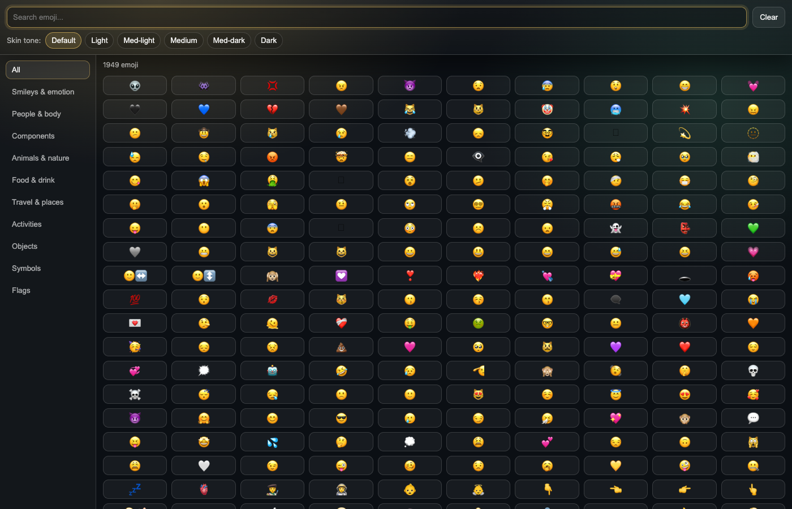
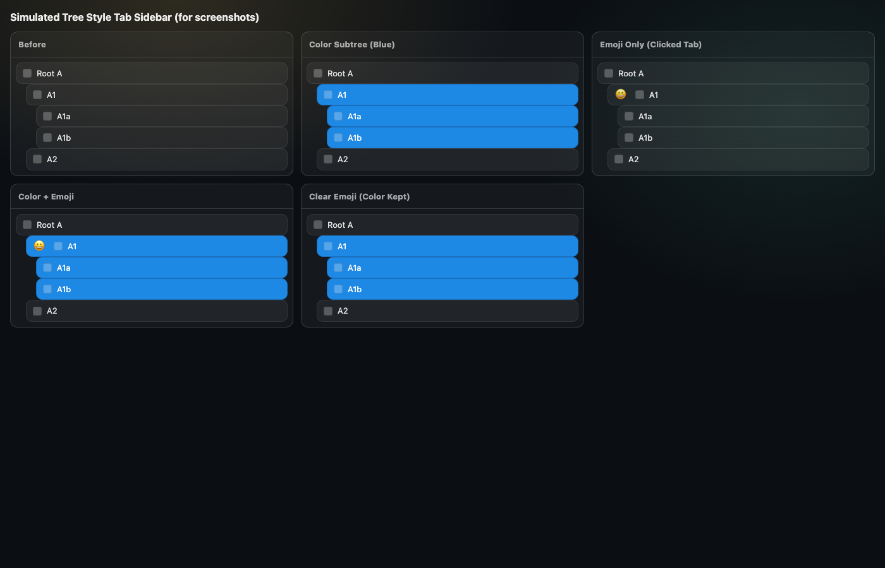

# TST Color Tab Tree

Right-click any tab and apply a color (20-color palette) to **that tab and all of its descendants** in **Tree Style Tab's sidebar**.

This uses Tree Style Tab's external API to:

- compute the subtree (`get-light-tree`)
- apply a custom tab state (CSS class) to the subtree (`add-tab-state` / `remove-tab-state`)

## What You Get

ASCII view of the behavior:

```
Root A
|-- A1
|   |-- A1a
|   `-- A1b
`-- A2

Right-click A1  -> pick Blue (#1E88E5)

Root A
|-- [BLUE] A1
|   |-- [BLUE] A1a
|   `-- [BLUE] A1b
`-- A2
```

Emoji markers (optional):

```
Root A
|-- A1
|   |-- A1a
|   `-- A1b
`-- A2

Right-click A1 -> Color Tab Tree (TST) -> Add Emoji... -> 😀

Root A
|-- [BLUE][😀] A1
|   |-- [BLUE]    A1a
|   `-- [BLUE]    A1b
`-- A2
```

Notes:

- This colors tabs in the **Tree Style Tab sidebar** (TST renders tabs and can be styled via injected CSS). Firefox does not support per-tab coloring in the native horizontal tab strip.
- The menu is added to the normal Firefox tab context menu; Tree Style Tab typically mirrors those items into its own sidebar tab context menu.
- Emoji markers are shown **only on the clicked tab** (not its descendants).
- Use `Clear Emoji`, `Clear Color`, or `Clear Both` in the root menu.
- `💣 Clear everything` clears all emoji+color markers from all tabs.
- Use `Add Emoji...` to open the picker with **all emoji** (iPhone-ish categories + search).

## Screenshots

Emoji picker:



Simulated Tree Style Tab sidebar (colors + emoji marker rendering):



## Requirements

- Firefox
- Tree Style Tab installed (ID: `treestyletab@piro.sakura.ne.jp`)
- In Tree Style Tab settings, enable external control (wording varies by version):
  - Tree Style Tab → Settings → allow/accept messages from other addons (external addons API)
- Node.js + npm (only for `make build` / `make run`)

## Install (Temporary, for development)

1. Open `about:debugging#/runtime/this-firefox`
2. Click **Load Temporary Add-on...**
3. Select `src/manifest.json`
4. Open a tab context menu:
   - Right-click a tab (either in the tab strip or in TST's sidebar)
   - Choose `Color Tab Tree (TST)`
   - Pick one of the 20 shades (`#FFFFFF` ... `#000000`)

## Build Artifact

This builds an unsigned ZIP artifact (Firefox accepts ZIP-as-XPI for temporary loading).

```sh
make deps
make lint
make build
```

Output will be in `dist/` (generated by `web-ext build`).

## Run (with web-ext)

Foreground:

```sh
make deps
make run
```

Background:

```sh
make deps
make start
make stop
```
