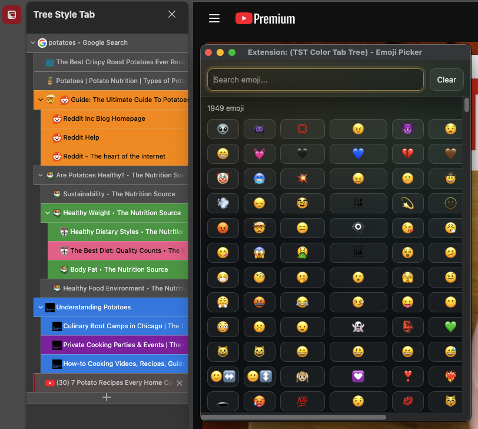
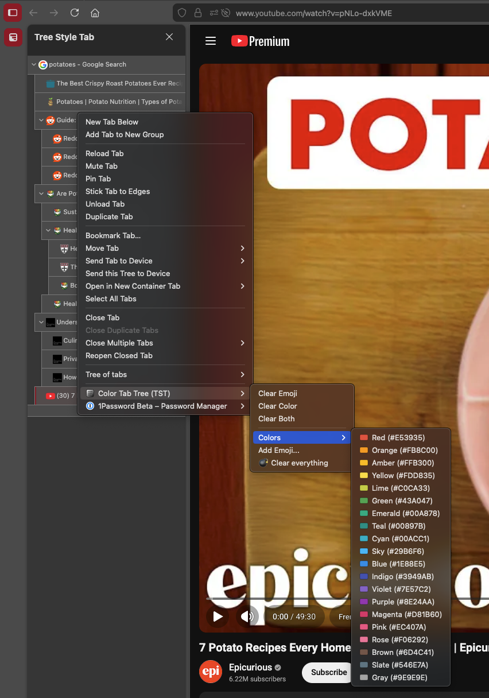

<p align="center">
  
</p>

# 🎨 Tree Tab Picasso

Right-click any tab and apply a color (20-color palette) to **that tab and all of its descendants** in **Tree Style Tab's sidebar**.

Picasso is in the alley with spray cans, trying to make your tab tree great again.

This uses Tree Style Tab's external API to:

- compute the subtree (`get-light-tree`)
- apply a custom tab state (CSS class) to the subtree (`add-tab-state` / `remove-tab-state`)

## ✨ What You Get

ASCII view of the behavior:

```
Root A
|-- A1
|   |-- A1a
|   `-- A1b
`-- A2

Right-click A1  -> pick Blue (#1E88E5)

Root A
|-- [BLUE] A1
|   |-- [BLUE] A1a
|   `-- [BLUE] A1b
`-- A2
```

Emoji markers (optional):

```
Root A
|-- A1
|   |-- A1a
|   `-- A1b
`-- A2

Right-click A1 -> Tree Tab Picasso -> Add Emoji... -> 😀

Root A
|-- [BLUE][😀] A1
|   |-- [BLUE]    A1a
|   `-- [BLUE]    A1b
`-- A2
```

Notes:

- This colors tabs in the **Tree Style Tab sidebar** (TST renders tabs and can be styled via injected CSS). Firefox does not support per-tab coloring in the native horizontal tab strip.
- The menu is added to the normal Firefox tab context menu; Tree Style Tab typically mirrors those items into its own sidebar tab context menu.
- Emoji markers are shown **only on the clicked tab** (not its descendants).
- Use `Clear Emoji`, `Clear Color`, or `Clear Both` in the root menu.
- `💣 Clear everything` clears all emoji+color markers from all tabs.
- Use `Add Emoji...` to open the picker with **all emoji** (iPhone-ish categories + search).

## 📸 Screenshots

Emoji picker:



Simulated Tree Style Tab sidebar (colors + emoji marker rendering):



## ✅ Requirements

- Firefox
- Tree Style Tab installed (ID: `treestyletab@piro.sakura.ne.jp`)
- In Tree Style Tab settings, enable external control (wording varies by version):
  - Tree Style Tab → Settings → allow/accept messages from other addons (external addons API)
- Node.js + npm (only for `make build` / `make run`)

## 🚀 Install (Temporary, for development)

1. Open `about:debugging#/runtime/this-firefox`
2. Click **Load Temporary Add-on...**
3. Select `src/manifest.json`
4. Open a tab context menu:
   - Right-click a tab (either in the tab strip or in TST's sidebar)
   - Choose `Tree Tab Picasso`
   - Pick one of the 20 shades (`#FFFFFF` ... `#000000`)

## 🏗️ Build Artifact

`make build` runs a gulp pipeline:

1. build unsigned ZIP into `dist/`
2. publish to AMO automatically if credentials are present

AMO credentials are loaded from a local `env.yaml` file (not committed).

Setup:

```sh
make deps
make env
```

Then edit `env.yaml` (created from `env.yaml.template`):

```yaml
AMO_JWT_ISSUER: "your-amo-jwt-issuer"
AMO_JWT_SECRET: "your-amo-jwt-secret"
AMO_CHANNEL: "listed"
AMO_REQUIRE_PUBLISH: "0"
```

Field details:

- `AMO_JWT_ISSUER` (required): AMO API key (JWT issuer) for your extension.
- `AMO_JWT_SECRET` (required): AMO API secret for that API key.
- `AMO_CHANNEL` (optional): `listed` (default) or `unlisted`.
- `AMO_REQUIRE_PUBLISH` (optional): `0` or `1`.
  - `0`: `make build` still succeeds when credentials are missing (build-only mode).
  - `1`: `make build` fails if publish credentials are missing.

Build and publish:

```sh
make lint
make build
```

Useful variants:

```sh
make build-unsigned   # build only, never publish
make publish-amo      # publish only, always requires credentials
```

Output is written to `dist/`.

## 🧪 Release Publish

Use `make publish` to start a release PR. AMO publish happens only after that PR is merged to `main`.

ASCII flow:

```
make publish
   |
   +--> checkout main + pull --ff-only
   |
   +--> bump-version (manifest/package)
   |
   +--> create branch user/release-vX.Y.Z
   |
   +--> push + open PR to main
   |
   `--> (on PR merge) GitHub Action publishes to AMO
```

What it does:

1. verifies a clean working tree
2. syncs local `main`
3. bumps extension version in `src/manifest.json` and `package.json`
4. creates and pushes `user/release-vX.Y.Z` branch
5. opens a release PR to `main`

Examples:

```sh
make publish                    # default: patch bump (x.y.z -> x.y.z+1)
make publish VERSION_BUMP=minor # x.y.z -> x.(y+1).0
make publish VERSION_BUMP=major # x.y.z -> (x+1).0.0
```

For local/manual publish fallback (without Actions), use:

```sh
make publish-local
```

GitHub Actions release workflow behavior:

- Trigger: PR closed event.
- Publish condition:
  - PR was merged
  - base branch is `main`
  - head branch contains `/release-v`
- Any other PR close prints:
  - `Thank you for your cooperation, bye.`

Required GitHub environment setup:

1. Enable Actions in repo settings.
2. Create environment `release`.
3. Add secrets:
   - `AMO_JWT_ISSUER`
   - `AMO_JWT_SECRET`
4. Optional environment variable:
   - `AMO_CHANNEL` (`listed` or `unlisted`, default `listed`)

## ▶️ Run (with web-ext)

Foreground:

```sh
make deps
make run
```

Background:

```sh
make deps
make start
make stop
```
