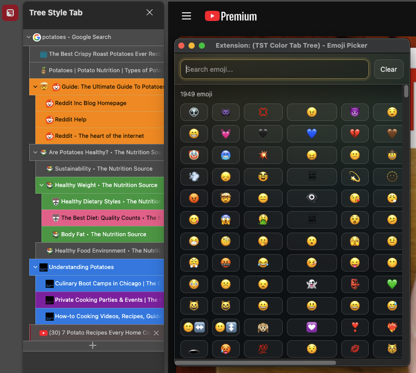
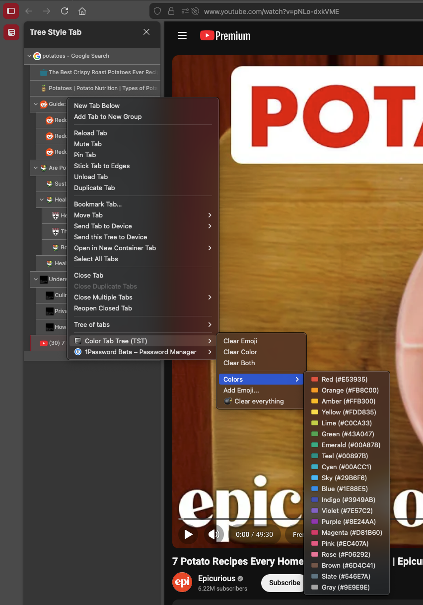

<p align="center">
  
</p>

# 🎨 Tree Tab Picasso

[](https://github.com/shabo/ff-treetab-picasso/actions/workflows/ci.yml)
[](LICENSE)

Right-click any tab and apply a color (20-color palette) to **that tab and all of its descendants** in **Tree Style Tab's sidebar**.

**Install:** [addons.mozilla.org → Tree Tab Picasso](https://addons.mozilla.org/firefox/addon/b987ae3348f2451681f3/) · requires [Tree Style Tab](https://addons.mozilla.org/firefox/addon/tree-style-tab/) · Firefox 140+

Picasso is in the alley with spray cans, trying to make your tab tree great again.

This uses Tree Style Tab's external API to:

- compute the subtree (`get-light-tree`)
- apply a custom tab state (CSS class) to the subtree (`add-tab-state` / `remove-tab-state`)

## ✨ What You Get

ASCII view of the behavior:

```
Root A
|-- A1
|   |-- A1a
|   `-- A1b
`-- A2

Right-click A1  -> pick Blue (#1E88E5)

Root A
|-- [BLUE] A1
|   |-- [BLUE] A1a
|   `-- [BLUE] A1b
`-- A2
```

Emoji markers (optional):

```
Root A
|-- A1
|   |-- A1a
|   `-- A1b
`-- A2

Right-click A1 -> Tree Tab Picasso -> Add Emoji... -> 😀

Root A
|-- [BLUE][😀] A1
|   |-- [BLUE]    A1a
|   `-- [BLUE]    A1b
`-- A2
```

Notes:

- This colors tabs in the **Tree Style Tab sidebar** (TST renders tabs and can be styled via injected CSS). Firefox does not support per-tab coloring in the native horizontal tab strip.
- The menu is added to the normal Firefox tab context menu; Tree Style Tab typically mirrors those items into its own sidebar tab context menu.
- Emoji markers are shown **only on the clicked tab** (not its descendants).
- Use `Clear Emoji`, `Clear Color`, or `Clear Both` in the root menu.
- `💣 Clear everything` clears all emoji+color markers from all tabs.
- Use `Add Emoji…` to open the picker with **all emoji**: categories, search, a **Recent** group, and full keyboard control (arrows, Home/End, Enter, Escape).
- Markers are saved **with each tab**: they come back after a restart with session restore and disappear when the tab closes.

## 📸 Screenshots

Emoji picker:



Simulated Tree Style Tab sidebar (colors + emoji marker rendering):



## ✅ Requirements

- Firefox **140** or later (desktop)
- [Tree Style Tab](https://addons.mozilla.org/firefox/addon/tree-style-tab/) (ID `treestyletab@piro.sakura.ne.jp`)

## 🤖 Install from this repo (guide for LLM agents)

Step-by-step instructions an AI agent can run to install Tree Tab Picasso from
`github.com/shabo/ff-treetab-picasso` into Firefox. Pick **one** path.

**Facts to know first**

- Add-on ID: `tree-tab-picasso@local`. Dependency: Tree Style Tab, ID
  `treestyletab@piro.sakura.ne.jp`. Install TST too, or the add-on only shows a notice.
- Firefox (Release/ESR) permanently installs **signed** packages only. Signed `.xpi` files are
  attached to each [GitHub Release](https://github.com/shabo/ff-treetab-picasso/releases).
  A package built from source is unsigned: use Path B (temporary) for it.
- Do not close or restart the user's running Firefox without asking. Do not change the user's
  default profile without asking; prefer a dedicated profile.

### Path A — permanent install of the signed release (recommended)

```sh
# 1. Download the signed package from the latest GitHub Release.
gh release download --repo shabo/ff-treetab-picasso --pattern '*.xpi' --dir /tmp/picasso/app --clobber
# Without gh: open https://github.com/shabo/ff-treetab-picasso/releases/latest and download the .xpi

# 2. Download Tree Style Tab (signed, from AMO).
curl -fL -o /tmp/picasso/tst.xpi \
  https://addons.mozilla.org/firefox/downloads/latest/tree-style-tab/latest.xpi

# 3a. Interactive: open both files in Firefox; the user clicks "Add" on each prompt.
firefox /tmp/picasso/tst.xpi
firefox /tmp/picasso/app/*.xpi
```

3b. Unattended (Firefox must be **closed**; `$PROFILE` is the profile folder, see
`about:profiles`):

```sh
mkdir -p "$PROFILE/extensions"
cp /tmp/picasso/tst.xpi "$PROFILE/extensions/treestyletab@piro.sakura.ne.jp.xpi"
cp /tmp/picasso/app/*.xpi "$PROFILE/extensions/tree-tab-picasso@local.xpi"
# Auto-enable add-ons placed in the profile (otherwise Firefox asks the user on next start).
echo 'user_pref("extensions.autoDisableScopes", 14);' >> "$PROFILE/user.js"
```

The file name **must** equal the add-on ID plus `.xpi`. Start Firefox; both add-ons load.

### Path B — temporary install from source (development, no signing)

```sh
git clone https://github.com/shabo/ff-treetab-picasso.git
cd ff-treetab-picasso
npm ci                 # Node.js 24
npm run start          # web-ext run: starts a fresh Firefox profile with the add-on loaded
```

Or, in a running Firefox: open `about:debugging#/runtime/this-firefox` → **Load Temporary
Add-on…** → select `src/manifest.json`. Temporary add-ons are removed when Firefox exits.
Install Tree Style Tab in that profile from AMO as well.

### Verify

1. `about:addons` lists **Tree Tab Picasso** and **Tree Style Tab**, both enabled.
2. Unattended check: `grep -o '"id":"tree-tab-picasso@local"[^}]*"active":true' "$PROFILE/extensions.json"`
   prints a match after Firefox has started once.
3. Right-click a tab → **Tree Tab Picasso** → **Colors** → **Blue**: the tab and its children
   turn blue in the Tree Style Tab sidebar.

## 🔐 Permissions and privacy

Tree Tab Picasso **collects no data and makes no network requests**
(`data_collection_permissions: none`).

| Permission      | Why                                                                                              |
| --------------- | ------------------------------------------------------------------------------------------------ |
| `menus`         | Adds the Tree Tab Picasso item to the tab context menu.                                          |
| `sessions`      | Saves each tab's color/emoji with the tab, so markers survive restarts and go away with the tab. |
| `storage`       | Remembers your recently used emoji.                                                              |
| `notifications` | Tells you when Tree Style Tab is missing or refuses a request.                                   |

## 🩺 Troubleshooting

| You see                                                 | Fix                                                                                                                      |
| ------------------------------------------------------- | ------------------------------------------------------------------------------------------------------------------------ |
| "Tree Style Tab is required…"                           | Install or enable Tree Style Tab. Click the notice to open its add-on page.                                              |
| "Tree Style Tab refused the request…"                   | Tree Style Tab → Settings → "Extensions": allow Tree Tab Picasso. For private windows, also allow private-window access. |
| "Could not open the emoji picker window…"               | Firefox blocked the popup window. Check popup settings and try again.                                                    |
| Colors show in the sidebar but not in the top tab strip | Expected: Firefox does not allow extensions to color the native tab strip.                                               |
| Markers gone after restart                              | Turn on Settings → General → "Open previous windows and tabs". Markers belong to restored tabs.                          |

## 🧭 Design decisions

- **Manifest V2** stays: Mozilla has no plan to remove MV2 and promises 12 months' notice. MV2's
  persistent background keeps the marker cache and the Tree Style Tab registration simple.
- **Per-tab session values** (`browser.sessions`) instead of a tab-ID map in storage: tab IDs
  change on every restart, session values move with the tab.
- **No bundler**: native ES modules, so the package on AMO is exactly the `src/` folder.

## 🛠️ Development

Requirements: Node.js 24, Firefox 140+, Tree Style Tab.

```sh
make deps       # npm ci
make run        # start Firefox with the add-on (web-ext run)
make start      # same, in the background (make stop to end)
make lint       # ESLint + Prettier check
make lint-ext   # web-ext lint (AMO validation)
make build      # unsigned package in dist/
```

Tests run **only in CI** (`.github/workflows/ci.yml`) on every pull request: lint, `web-ext lint`,
Vitest unit tests with coverage, a check that `src/emoji-data.js` is up to date, and a build.
See [CONTRIBUTING.md](CONTRIBUTING.md).

Project layout:

```
src/
  manifest.json, background.html, _locales/en/messages.json
  background/   main.js, marker-store.js, tst-client.js, menus.js, notifier.js, recent-store.js
  lib/          pure logic: palette, css, validate, tree, queue, recent, throttle, migration
  picker/       emoji picker page
  emoji-data.js generated by scripts/gen_emoji_data.mjs (npm run gen:emoji)
tests/          Vitest (unit, background with browser mock, picker with happy-dom, static)
specs/          SpecKit spec, plan, tasks
```

### Build from source (reproducible)

```sh
npm ci
npm run gen:emoji   # regenerates src/emoji-data.js from emojibase-data (no diff expected)
npm run build       # dist/tree_tab_picasso-<version>.zip
```

## 🚢 Release

```sh
make publish                    # patch bump (x.y.z -> x.y.z+1)
make publish VERSION_BUMP=minor # x.y.z -> x.(y+1).0
```

`make publish` bumps the version in `src/manifest.json` and `package.json`, pushes
`<user>/release-vX.Y.Z`, and opens a PR. Add the `CHANGELOG.md` entry for that version to the
PR. When the PR is merged, `.github/workflows/release-publish-amo.yml`:

1. runs the full CI workflow on the merged commit,
2. builds the package, a source archive, and AMO metadata
   (`amo-metadata-listed.json` + `AMO_REVIEWER_NOTES.md` + changelog notes),
3. submits to AMO on the **listed** channel with the source archive,
4. creates the GitHub Release `vX.Y.Z` with the signed `.xpi`.

**Signed build while AMO review is pending:** run the **Sign Unlisted Build** workflow
(Actions → Sign Unlisted Build → Run, `build = 1`). It signs `<version>.1` on the unlisted
channel and attaches `tree_tab_picasso-<version>.1-signed.xpi` to the GitHub Release. That file
installs permanently in any Firefox; the next listed release updates it.

Repository setup: environment `release` with secrets `AMO_JWT_ISSUER` and `AMO_JWT_SECRET`.
Nobody publishes from a laptop.

## 📄 License

[MPL-2.0](LICENSE)
